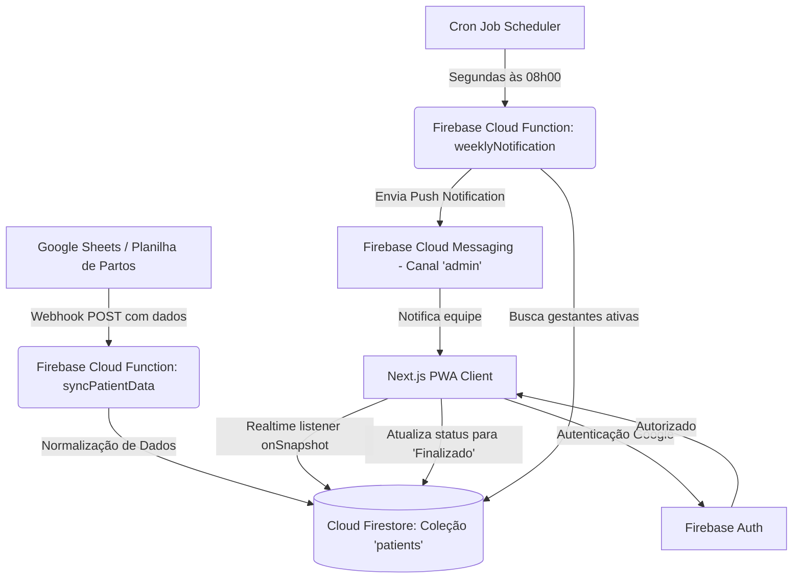

# Documentação do Projeto: DPP Controller - Parteras Sin Fronteras

Esta documentação descreve o estado atual, a arquitetura técnica, as funcionalidades implementadas e as recentes alterações do projeto **DPP Controller**, desenvolvido para a iniciativa **Parteras Sin Fronteras**. Este documento serve como base técnica e gerencial para validação pelo **Senior Software Engineer** e **Product Owner (PO)**.

---

## 1. Contexto e Objetivo do Projeto

O **DPP Controller** é uma aplicação web progressiva (PWA) desenvolvida para gerenciar e monitorar o período gestacional de grávidas atendidas pelo projeto social *Parteras Sin Fronteras*. O foco principal é a **Data Provável do Parto (DPP)**.

O painel exibe e filtra automaticamente as gestantes que estão na "janela de parto" — definida como o período entre a **38ª e a 42ª semana de gestação**. Isso permite que as equipes de parto planejem o atendimento, otimizem recursos e acompanhem o desfecho de cada gestação com agilidade.

---

## 2. Arquitetura e Stack Tecnológica

A solução utiliza tecnologias modernas com foco em funcionamento offline (essencial para áreas de atendimento com conectividade instável), carregamento rápido e facilidade de deploy:

*   **Frontend (PWA)**:
    *   **Framework**: Next.js 15+ (com App Router e suporte a exportação estática `output: "export"` para hospedagem otimizada).
    *   **Estilização**: TailwindCSS (design moderno, responsivo e baseado em tokens).
    *   **Gerenciador PWA & Service Worker**: Serwist (gerencia o cache local e o comportamento offline).
    *   **Ícones**: Lucide React.
    *   **Manipulação de Datas**: `date-fns` (cálculo robusto de semanas gestacionais a partir da DPP).
*   **Backend & Banco de Dados (Firebase)**:
    *   **Firebase Auth**: Autenticação segura integrada com provedor do Google (Google Sign-In).
    *   **Cloud Firestore**: Banco de dados NoSQL com persistência offline ativada no navegador (`enableMultiTabIndexedDbPersistence`).
    *   **Firebase Cloud Functions**: Funções serverless em Node.js (TypeScript) para integração via webhooks e cron jobs agendados.
    *   **Firebase Hosting**: Distribuição global rápida de arquivos estáticos.
    *   **Firebase Cloud Messaging (FCM)**: Infraestrutura para envio de notificações push.
*   **CI/CD**:
    *   **GitHub Actions**: Deploy automatizado de funções e frontend para o Firebase.

---

## 3. Fluxo de Dados e Integração

Abaixo está o diagrama do fluxo de dados, demonstrando como os dados vindos de planilhas do Google Sheets se sincronizam com o Firestore e chegam aos dispositivos dos usuários:

---

## 4. Funcionalidades Implementadas (O que foi realizado)

### 4.1. Autenticação Segura (Firebase Auth)
*   Acesso exclusivo para a equipe de parteiras através de login com o Google.
*   A aplicação barra acessos não autorizados e redireciona os usuários para a tela de login caso a sessão expire.
*   Gerenciamento de estado de autenticação centralizado no `AuthContext` do React.

### 4.2. Painel de Partos (Main Dashboard)
*   **Filtro da Janela de Parto**: A tela principal filtra em tempo real as gestantes que estão no intervalo crítico de **38 a 42 semanas de gestação**.
*   **Cálculo Dinâmico**: O cálculo utiliza a data atual e a data informada no campo DPP (considerando a DPP como 40 semanas completas de gestação):
    $$\text{Semanas Gestacionais} = 40 - \text{diferença em semanas até a DPP}$$
*   **Ordenação**: Gestantes mais próximas do parto (menor tempo restante até a DPP) são exibidas no topo do painel.
*   **Ações**: Botão para "Finalizar Acompanhamento", que atualiza o status no banco de dados.

### 4.3. Histórico de Acompanhamentos
*   Tela dedicada contendo todas as gestações cujo acompanhamento foi finalizado (status "Finalizado").
*   Ordenado de forma decrescente pelo momento da finalização (mais recentes no topo).
*   Preserva o histórico de dados mesmo após a remoção da paciente do painel principal (janela ativa).

### 4.4. Configurações de Notificações
*   Interface amigável para ativação/desativação de notificações push.
*   Integração com a API de permissões do navegador (solicita e respeita a permissão do usuário).
*   Persistência do token de notificação associado ao usuário logado em `/users/{userId}/fcmToken` no Firestore.

### 4.5. Webhook de Sincronização Automática (Google Sheets Integration)
*   Cloud Function HTTP (`syncPatientData`) que atua como barramento de ingestão.
*   Recebe dados em formato JSON vindos de ferramentas de automação (ex: Make, Zapier ou Google Apps Scripts rodando na planilha).
*   Realiza o "upsert" (cria ou atualiza) inteligente dos dados no Firestore usando o ID da linha da planilha como ID do documento, evitando duplicidades.

### 4.6. Notificações Semanais Agendadas (Cron Job)
*   Cloud Function executada via Pub/Sub de forma programada toda segunda-feira às 08:00 AM (fuso horário de São Paulo).
*   Consolida o número de gestantes atualmente sendo acompanhadas no status "Acompanhando" e envia uma notificação push para o tópico `admin`, alertando a equipe para acessar o painel e conferir a escala da semana.

---

## 5. Alterações Recentes e Motivações (Histórico de Correções e Melhorias)

| Componente | Alteração Realizada | Motivo da Alteração |
| :--- | :--- | :--- |
| **Cloud Function (`syncPatientData`)** | **Normalização de datas de DPP** (de ISO `yyyy-MM-dd...` para `dd/MM/yyyy`). | Os dados inseridos no Google Sheets podiam vir em formatos inconsistentes (ISO gerado por formulários vs. texto manual). A conversão na entrada garante uniformidade do banco e evita falhas de processamento no PWA. |
| **Cloud Function (`syncPatientData`)** | **Normalização do status** (remoção de espaços e padronização para caixa baixa, convertendo em "Finalizado" ou "Acompanhando"). | Evita bugs onde a planilha enviava strings com espaços (ex: `"finalizado "`) ou letras maiúsculas/minúsculas diferentes, garantindo que o status no banco respeite rigidamente o enum do projeto. |
| **Firestore (`firestore.rules`)** | **Configuração de regras de segurança** (`allow read, write: if request.auth != null`). | Inicialmente as regras de acesso ao banco de dados estavam abertas ou no modo padrão. A nova regra garante a confidencialidade das informações médicas das pacientes, permitindo leitura e escrita somente para usuários autenticados na aplicação. |
| **PWA / Build (`next.config.ts`, `src/app/manifest.ts`)** | **Remoção de erros de build estático do Next.js e Turbopack** (desativação de validações estritas no build e uso de `force-static` no manifesto). | Para implantar o PWA de forma 100% estática (`output: "export"`) e evitar conflitos com o service worker gerado pelo Serwist/Webpack durante o build do Next.js 15 com Turbopack ativo. |
| **Dashboard (`src/app/page.tsx`)** | **Tratamento flexível de data (fallback parsing)** na interface. | Garante que se alguma data for salva fora do formato padrão por erro na planilha, o aplicativo não apresentará tela branca (crash) para as parteiras, aplicando um parse flexível com fallback. |

---

## 6. Pontos de Atenção e Próximos Passos (Para Validação de PO e Engenharia)

1.  **Notificações Push com FCM Real**:
    *   **Estado Atual**: A Settings UI solicita a permissão do navegador e armazena um `mock-token-{timestamp}` no Firestore para fins de teste de fluxo. A infraestrutura de envio está implementada na Cloud Function.
    *   **Recomendação**: Conectar as credenciais reais do Firebase Cloud Messaging (incluindo chaves VAPID no frontend) no momento em que as chaves de produção do cliente forem definidas.
2.  **Segurança do Webhook de Entrada**:
    *   **Estado Atual**: A Cloud Function HTTP valida apenas se o método é `POST` e se os campos obrigatórios estão presentes.
    *   **Recomendação**: Adicionar um cabeçalho de autorização (ex: `Authorization: Bearer <TOKEN>`) na Cloud Function e na automação do Sheets para impedir que terceiros enviem requisições maliciosas.
3.  **Tipagem de Datas no Firestore**:
    *   **Estado Atual**: A data da DPP é guardada como string (`"dd/MM/yyyy"`).
    *   **Recomendação**: Em futuras refatorações, seria ideal que o Webhook convertesse a string para um `Timestamp` nativo do Firestore. Isso facilitaria filtros de busca avançados diretamente no banco de dados, reduzindo o volume de transferência de dados para o cliente.
